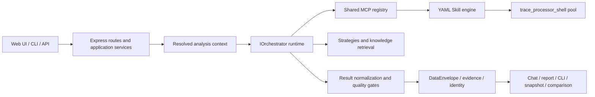

# SmartPerfetto Technical Architecture

[English](technical-architecture.en.md) | [中文](technical-architecture.md)

<!-- i18n-headings: paired -->

This document explains the current implementation boundaries. See
[Architecture Overview](overview.en.md) for a shorter entry point,
[Agent Runtime](agent-runtime.en.md) for runtime details, and the
[Data Contract](../../backend/docs/DATA_CONTRACT_DESIGN.en.md) for table and
evidence transport.

## 1. More Than One Web Plugin

SmartPerfetto exposes one analysis core through several products:

| Surface | Entry | Important boundary |
|---|---|---|
| Source Web | `./start.sh` | Uses committed `frontend/`; normal users do not build the Perfetto submodule |
| Frontend development | `./scripts/start-dev.sh` | Only for AI Assistant plugin work |
| Docker | `docker-compose.hub.yml` | Cannot read host Claude Code login state |
| npm CLI | `smp` / `smartperfetto` | Node.js `>=24 <25`; no Web UI |
| Portable | Three platform release assets | Bundles Node.js 24, backend, frontend, trace processor, and runtime assets |
| HTTP/SSE API | `/api/*` | Web, CLI support, and integrations reuse backend contracts |

A feature cannot be verified on only one entry point. The authoritative surface
list is [`.claude/rules/product-surface.md`](../../.claude/rules/product-surface.md).

## 2. Component Boundaries



Primary directories:

- `backend/src/routes/`: HTTP/SSE and input boundaries;
- `backend/src/assistant/application/`: session preparation and reuse;
- `backend/src/agentRuntime/`: provider-neutral runtimes and result convergence;
- `backend/src/agentv3/`: shared MCP, strategy loading, planning, and verifier
  compatibility namespace;
- `backend/src/services/skillEngine/`: YAML Skill execution;
- `backend/src/services/selfEvolution/`: RunManifest, feedback projections,
  eval/replay, proposals, gates, overlay generations, and upgrade reconciliation;
- `backend/src/services/externalIssueReporting/`: completed-run opportunity
  detection, provider pins, no-tool triage, output validation, and GitHub drafts;
- `backend/skills/`: deterministic trace-evidence programs;
- `backend/strategies/`: scene methodology, prompts/templates, and report rules;
- `backend/src/services/traceProcessorService.ts`: trace processor lifecycle and leases;
- `perfetto/ui/src/plugins/com.smartperfetto.AIAssistant/`: plugin source;
- `frontend/`: committed UI consumed by source, Docker, and portable products.

## 3. Main Analysis Flow

```text
POST /api/agent/v1/analyze
  -> AgentAnalyzeSessionService.prepareSession()
  -> resolve workspace / user / trace / provider / source / knowledge context
  -> createAgentOrchestrator()
  -> select Claude / OpenAI / Pi / OpenCode / Qoder runtime
  -> use the shared MCP registry for SQL, Skills, knowledge, and planning
  -> selected source: bounded lookup or structured SourceUseDecision stop
  -> DataEnvelope + evidence/claim/identity sidecars
  -> final-result normalization / report-contract + source-claim-binding gate
  -> SSE chat projection + HTML report + snapshot + CLI artifact
```

`options.analysisMode` supports:

- `fast`: lightweight tools and deterministic direct-evidence paths;
- `full`: full tools, planning, and quality checks;
- `auto`: non-negotiable context rules, then semantic classification.

When a reference trace, codebase, or private knowledge source requires full
context, a requested `fast` mode must not silently drop the capability.

### 3.1 Enterprise Identity Boundary

`/api/auth/oidc/login` and its callback are public bootstrap boundaries. Other
`/api` routes pass through the unified `authenticate` middleware by default.
`EnterpriseOidcClient` uses standard discovery plus Authorization Code and
PKCE, validating the ID Token and nonce inside that boundary. A short-lived
state/nonce/PKCE transaction lives in a signed HttpOnly cookie. After login,
only an opaque signed session id is stored in a HttpOnly cookie; tenant,
workspace, role, scope, revocation, and expiry remain backed by enterprise
SQLite state.

Built-in OIDC trusts only the normalized issuer and subject. The issuer derives
the tenant id, and issuer plus subject derive the user id. Login automatically
creates or reuses that user's single personal workspace.
`sso_personal_workspaces` plus database triggers prevent another user from
joining it. IdP tenant, workspace, and role claims cannot override this
ownership boundary. The frontend completes the session gate before loading
Perfetto. Analysis, Provider, codebase, trace, and Trace Processor heartbeat
requests use the shared credentialed fetch/header policy with the cookie and
required CSRF token. Browser storage is tenant/user/workspace scoped, and OIDC
mode never imports old unscoped data.

Cookie-authenticated mutations use an exact Origin check in addition to CORS,
because CORS alone does not prevent a browser from sending a cross-site
mutation, and they also require the session-derived CSRF token. The callback
establishes the session and redirects directly to `FRONTEND_URL`; there is no
popup or frontend workspace-selection flow.

## 4. Runtimes And Providers

Every runtime currently registered by `PRODUCTION_RUNTIME_KINDS` implements the
shared `IOrchestrator` contract:

| Runtime | Primary providers | Resume state |
|---|---|---|
| `claude-agent-sdk` | Anthropic, Bedrock, Vertex, Claude-compatible, local Claude login | Claude session id |
| `openai-agents-sdk` | OpenAI Responses, OpenAI-compatible, Ollama/chat-completions | history + response id |
| `pi-agent-core` | Provider Manager custom profile / Pi model config | opaque transcript |
| `opencode` | OpenCode SDK and custom providers | OpenCode session id + isolated directories |
| `qoder-agent-sdk` | Qoder CLI login or PAT, custom providers | Qoder session id; private-knowledge runs do not persist opaque sessions |

Canonical loaders and capabilities come from
`backend/src/agentRuntime/runtimeDescriptors.ts`, with implementations under
`backend/src/agentRuntime/engines/`. `backend/src/agentOpenAI/` is a
compatibility facade for old import paths. `backend/src/agentv3/` still owns
canonical shared MCP, strategy, planning, and verifier layers, so the namespace
as a whole is not legacy.

Selection order is request-level Provider Manager profile, persisted session
snapshot, `SMARTPERFETTO_AGENT_RUNTIME`, then the default runtime. A session
pins its provider/runtime at creation; resume must not silently follow a newly
activated profile.

Provider Manager profiles override `.env` fallback. Docker and portable
authentication environments differ from the host, so source-only Claude login
cannot be documented as universal.

## 5. MCP Tool Surface

`backend/src/agentv3/mcpToolRegistry.ts` is the source for descriptors,
exposure, and allowlists; `claudeMcpServer.ts` supplies implementations and
request-shaped composition. The total is intentionally dynamic:

- fast and full requests expose different surfaces;
- code-aware tools require permission;
- comparison tools require a reference trace;
- artifact tools depend on session capabilities;
- deprecated/internal tools do not automatically become public contracts.

Docs describe tool families and visibility rather than copying a static count
or maintaining a second registry. See the [MCP Tools Reference](../reference/mcp-tools.en.md).

## 6. Strategies And Skills

The two content layers have different jobs:

```text
Markdown Strategy / Template
  -> classification, methodology, constraints, final_report_contract

YAML Skill
  -> SQL / iterator / conditional / composite execution
  -> deterministic DataEnvelope evidence
```

Durable prompt content does not belong in TypeScript. Scene methodology lives
in `backend/strategies/`; deterministic evidence lives in `backend/skills/`.
Skill inventory, scene lists, and the pipeline catalog are discovered from the
tree/frontmatter/index rather than copied into code or docs.

Rendering-pipeline teaching content under `docs/rendering_pipelines/` is read at
runtime through `doc_path`. It is synchronized from a pinned source rather than
edited manually:

```bash
npm run sync:rendering-pipelines -- --source <checkout> --apply
npm run check:rendering-pipelines
```

See the [Skill System Guide](../reference/skill-system.en.md).

## 7. Trace Processor And Evidence

`TraceProcessorService` manages the `trace_processor_shell` pool, port leases,
trace loading, and SQL RPC. Source, npm, Docker, and portable products must
follow the same pin and integrity rules. An explicit `TRACE_PROCESSOR_PATH` is
user-owned; launchers do not change its permissions or overwrite it.

DataEnvelope output feeds:

- the evidence contract;
- deterministic claim verification;
- process/thread identity resolution;
- report provenance;
- analysis-result snapshots;
- comparison metrics.

Chat readability and audit provenance are separate surfaces. Hiding raw SQL
from chat must not remove provenance from reports, snapshots, or CLI artifacts.

## 8. Two Comparison Products

SmartPerfetto maintains two distinct comparison products:

1. **Raw trace comparison** queries any baseline + comparison pair from the
   same workspace in one AI session. CLI `smp compare` and the dual-view UI
   share backend comparison context, Skills, and report sections; API
   compatibility roles remain current + reference.
2. **Analysis-result comparison** compares persisted snapshots across windows
   or traces and follows workspace/RBAC/share rules.

They may reuse standard metrics and report sections, but raw comparison must
not become a private UI/CLI prompt, and snapshot comparison must not be
confused with the live arbitrary raw-trace dual view.

## 9. Source And Knowledge Context

### Code-Aware

Codebases pass through `PathSecurityGate` preview/register/reindex.
`metadata_only` exposes `CodeRef`; `provider_send` additionally requires
registration consent and an explicit request mode. Raw source never belongs in
sessions, logs, SSE, reports, or exports.

Registration only makes a codebase selectable; it does not attach source.
`search_codebase` / `read_codebase_file` work against a live root without an
active index. Reindexing is optional acceleration for semantic/symbol lookup
and patch workflows. Full analysis with selected source and a queryable trace
anchor must perform lookup or record a structured stop status first.
`SourceUseDecisionV1` records selected/queried/used IDs, status, and coverage.

Trace/Skill/SQL proves occurrence, while `CodeRef` proves mechanism.
`SourceClaimBindingV1` is limited to
`corroborated|compatible|ambiguous|unverified`; `corroborated` requires verified
same-claim trace occurrence plus `provider_send` body/indexed evidence.
`metadata_only` is locate-only. One canonical projector provides safe
provenance for SSE, reports, CLI, snapshots, and APIs; Web further reduces it
to the current-run receipt.

### Android Internals

The signed built-in Knowledge Pack and a private checkout are separate sources:

- the bundled Pack ships with every product and can update through a TUF
  channel; its provenance is background knowledge, never current-trace
  evidence;
- a private checkout requires a path allowlist, rights acknowledgement,
  provider consent, and request-level source selection.

The resolved analysis context pins codebase/knowledge generations,
tenant/workspace/user, provider consent, and session continuity. Resume,
reports, and snapshots must preserve those boundaries.

## 10. Self-Evolution Data And Publication

Immutable identity decouples online analysis from evolution publication:

```text
RunManifest + effective public feedback
  -> bounded curation proposal
  -> materialized treatment
  -> validation/holdout paired replay
  -> qualified + accepted proposal
  -> content-addressed overlay artifact
  -> atomic generation pointer
  -> immutable effective registry snapshot for each new run
```

Persistence has explicit responsibilities. Feedback JSONL is the fact source
and SQLite is a rebuildable projection. Eval cases, replay, proposals/gate
attempts, the overlay registry, and reconciliation retain separate versioned
artifacts and bindings. Private feedback uses another path that the curation
reader never opens.

Publication does not mutate the global Skill registry in place. A sealed run
retains one snapshot; only a new run resolves a new generation. Apply/revert
publishes through an idempotent action saga, while startup/upgrade reconciles
build identity and base fingerprints. Missing persistence, gate binding, or
successful reconciliation fails closed. See the
[Self-Evolution guide](../getting-started/self-evolution.en.md).

## 10A. Agent-Assisted External Feedback

```text
persisted analysis_completed + RunManifest + optional snapshot
  -> deterministic opportunity signals
  -> explicit user action
  -> same provider/runtime snapshot, no-tool triage
  -> strict reference/trust/content validation
  -> user answers + sensitive-data confirmation
  -> deidentified notSubmitted GitHub draft
```

Source resolution cross-checks `(tenant, workspace, sessionId, runId,
runManifestId, snapshotId)` and never reads the current session result or
triggers completed-result recovery. `providerSnapshotHash` binds review to the
source run; missing, changed, or unsupported pins return deterministic
verification guidance only. The neutral `publicArtifactSanitizer` is shared by
M9 contribution bundles and M10 drafts, but their business state machines never
call each other. See
[Agent-Assisted GitHub Feedback](../getting-started/agent-assisted-feedback.en.md).

## 11. Output And Persistence

The final result is not one Markdown string:

| Surface | Retained content |
|---|---|
| SSE / AI chat | Readable conclusion, necessary evidence summary, and progress |
| HTML report | Evidence, claims, identity, background references, and appendix |
| CLI artifact | Turn, report, resume state, and machine-readable output |
| Analysis-result snapshot | Standard metrics, evidence references, comparison input |
| Provider session snapshot | Runtime/provider-specific resume state |
| Source provenance | Safe SourceUseDecision, relative `CodeRef`, and trace-to-mechanism bindings; the Web receipt retains no `CodeRef` |

`final_report_contract`, normalization, and quality gates converge provider
outputs on shared semantics rather than patching one provider-specific string
at one exit.

## 12. Release Assets

Release surfaces are independent:

- npm bundles CLI dist, Skills, Strategies, SQL, trace processor, and the
  Knowledge Pack;
- portable additionally bundles Node.js 24, native dependencies, backend,
  `frontend/`, and a launcher;
- Docker builds a Linux image from `main` using committed `frontend/` and
  runtime assets;
- normal source use also consumes `frontend/`; only UI development builds the
  submodule.

See the [Release Runbook](../reference/release.en.md) and
[Portable Packaging](../reference/portable-packaging.en.md).

## 13. Verification

Verification depends on change type; the complete landing gate is:

```bash
npm run verify:docs
npm run verify:pr
```

Important focused entries:

```bash
cd backend
npm run validate:skills
npm run validate:strategies
npm run test:report-contracts
npm run test:source-claim-contract
npm run verify:code-aware-semantic-delta
npm run test:self-evolution
npm run test:scene-trace-regression
npm run cli:pack-check
npm --prefix backend run verify:codebase-aware
```

Additionally:

- dual-trace browser contract: `npm run test:e2e:dual-trace`;
- trace corpus: `npm run trace:regression`;
- runtime-read pipeline docs: `npm run verify:rendering-pipelines`;
- portable: use the script checks, launcher cross-build, full package build,
  and manifest verification in the [testing rules](../../.claude/rules/testing.md);
- provider-backed E2E requires safely available credentials; unit tests are not
  a substitute;
- Android capture can claim a recording smoke only with a connected device;
  offline checks prove proposal/config/CLI contracts only.

## 14. Change Map

| Goal | Change location |
|---|---|
| Add deterministic analysis | `backend/skills/` |
| Change AI methodology or report rules | `backend/strategies/` |
| Add/change an MCP tool | registry + implementation + reference + tests |
| Change DataEnvelope | backend source + generator + generated frontend types + consumers |
| Change API contract | route/application service + tests + API docs |
| Change AI Assistant UI | Perfetto plugin + dev/browser test + `frontend/` prebuild |
| Change source-use decisions/conclusion provenance | Source policy + MCP ledger/finalizer + claim binding + report/CLI/snapshot/Web projection + semantic gate |
| Change runtime/provider | `agentRuntime/` + Provider Manager + session snapshot tests |
| Change Self-Evolution | `services/selfEvolution/` + admin routes/UI + focused tests + current contract docs |
| Change Agent external feedback | `services/externalIssueReporting/` + agent route + AI plugin + Issue Form + `test:external-issue-reporting` |
| Change release assets | package/release scripts + runtime-asset tests + release docs |

After architecture changes, use [`AGENTS.md`](../../AGENTS.md) and the relevant
`.claude/rules/` file to choose the required verification tier.
