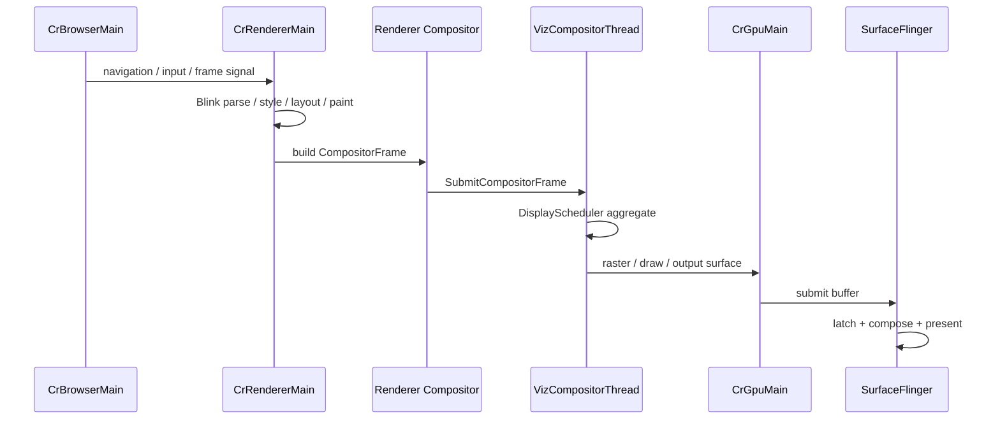

# Chrome Browser Viz Pipeline

Chrome 浏览器进程不同于 Android WebView。独立 Chrome 通常使用 Browser / Renderer / GPU-Viz 多进程架构，Renderer 提交 CompositorFrame，Viz 在 GPU 进程侧聚合并输出到 Android 显示系统。

## 典型链路

## 线程角色

| 线程 | 职责 | 常见 trace 线索 |
|---|---|---|
| `CrBrowserMain*` | 浏览器主进程 UI、导航、输入协调 | `CrBrowserMain*` |
| `CrRendererMain*` | Blink 主线程，HTML/CSS/JS、layout、paint | `CrRendererMain*`, Blink slices |
| `VizCompositorThread` | Viz 合成调度，聚合 CompositorFrame | `DisplayScheduler`, `BeginFrame`, `SubmitCompositorFrame` |
| `CrGpuMain*` | GPU raster、draw、output surface | `CrGpuMain*`, GPU slices |
| `SurfaceFlinger` | Android 系统合成 | `latchBuffer`, `presentDisplay` |

## 和 WebView 的区别

| 维度 | Chrome Browser | Android WebView |
|---|---|---|
| 进程模型 | Browser / Renderer / GPU 多进程更完整 | 嵌入宿主 App，部分服务可能 in-process |
| 宿主关系 | Chrome 自己是前台应用 | WebView 受宿主 App 主线程和 RenderThread 影响 |
| 合成入口 | Viz / GPU 进程主导 | GL Functor、SurfaceControl、SurfaceView wrapper 或 TextureView 变体 |
| 排查重点 | Renderer/Viz/GPU 跨进程节奏 | 宿主 App 与 Chromium 协作边界 |

## SmartPerfetto 检测信号

`pipeline_chrome_browser_viz` 主要依赖：

- `VizCompositorThread`
- `CrBrowserMain*`
- `CrRendererMain*`
- `CrGpuMain*`
- `*DisplayScheduler*`
- `*BeginFrame*`
- `*Chromium.Compositor*`

检测会排除 `WebViewChromium`、`WebView*loadUrl*`、Flutter 和游戏引擎线程，避免把嵌入式 WebView 或其他框架误判为独立 Chrome。
