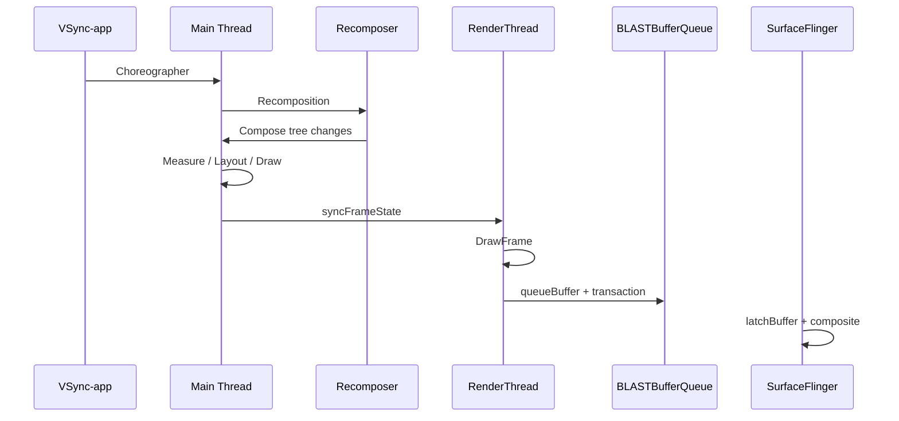

# Jetpack Compose Standard Pipeline

Jetpack Compose 仍然走 Android HWUI / RenderThread / BLAST 这一条主链路，但 UI 构建阶段由 Recomposer 驱动，性能问题往往出现在 recomposition、measure/layout 和 DisplayList 生成阶段，而不只是传统 View 的 `onMeasure` / `onLayout` / `draw`。

## 典型链路

## 线程角色

| 线程 | 职责 | 常见 trace 线索 |
|---|---|---|
| `main` | Composition、layout、draw、DisplayList 生成 | `Recompos*`, `Compose:*`, `Choreographer#doFrame` |
| `RenderThread` | 执行 DisplayList、GPU 命令提交、queueBuffer | `syncFrameState`, `DrawFrame`, `queueBuffer` |
| `SurfaceFlinger` | latch、合成、present | `latchBuffer`, `commit`, `presentDisplay` |

## 性能关注点

- Recomposition 风暴：State 读取范围过宽，导致大量 Composable 重执行。
- Layout 过重：复杂 modifier、嵌套 layout 或 Lazy 列表测量成本过高。
- 主线程阻塞：Binder、IO、锁等待会直接阻塞 Composition/Layout。
- RenderThread 饱和：复杂绘制、shader、纹理上传仍会落到 RenderThread/GPU。

## SmartPerfetto 检测信号

`pipeline_compose_standard` 主要依赖：

- `RenderThread` + `main` 同时存在。
- `Recompos*`
- `Compose:*`
- `*CompositionLocal*`
- `*measure*`
- `DrawFrame*`

检测时会排除 Flutter 的 `1.ui` 和 WebView 的 `CrRendererMain`，避免把跨框架 trace 误判成 Compose。
