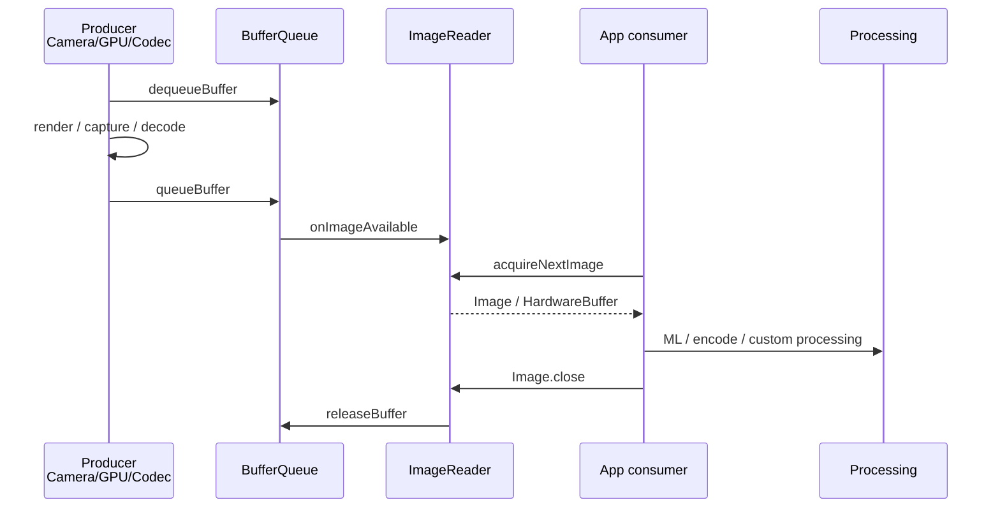

# ImageReader Pipeline

ImageReader 让应用作为 BufferQueue consumer 直接获取图像帧。它常用于 Camera2 自定义处理、ML 推理、屏幕录制、MediaCodec 后处理，以及部分浏览器/SDK 的特殊帧获取路径。

## 典型链路

## 线程角色

| 线程 | 职责 | 常见 trace 线索 |
|---|---|---|
| Producer | Camera、GPU、Codec 或自定义渲染生产帧 | `dequeueBuffer`, `queueBuffer`, `Camera`, `MediaCodec` |
| ImageReader callback | 通知并获取可用帧 | `ImageReader`, `onImageAvailable`, `acquireNextImage` |
| App processing | ML、编码、图像处理或再展示 | 自定义业务 slice、CPU/GPU 工作 |

## 性能关注点

- `queueBuffer` 到 `onImageAvailable` 的通知延迟。
- `acquireNextImage` 后处理耗时是否阻塞释放。
- `maxImages` 是否过大导致内存压力，或过小导致 producer backpressure。
- `Image.close()` 是否及时调用。
- HardwareBuffer 是否真正零拷贝，还是落入额外 CPU copy。

## SmartPerfetto 检测信号

`pipeline_imagereader_pipeline` 主要依赖：

- `*ImageReader*`
- `*acquireNextImage*`
- `*AImageReader*`
- `*HardwareBuffer*`
- `*onImageAvailable*`
- `*queueBuffer*`
- `*MediaCodec*`

ImageReader 可以和 Camera、MediaCodec、GPU 或 Web/Chrome 管线共存，因此不应被视为互斥主链路。
