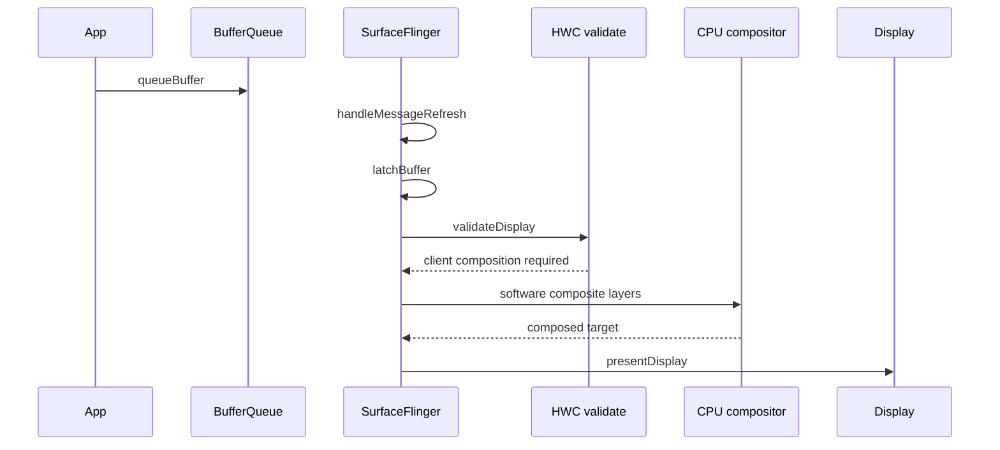

# Software Compositing Pipeline

软件合成是 SurfaceFlinger 在 HWC/GPU 合成不可用或不适合时的降级路径。它通常意味着更多 CPU 像素处理、SurfaceFlinger 主线程耗时增加，以及更高的显示延迟风险。

## 典型触发场景

- Layer 数量超过硬件叠加层能力。
- 像素格式、混合模式或安全内容限制导致 HWC 不能直接合成。
- GPU 合成不可用、过载或被调试配置禁用。
- 特定 OEM 降级路径或显示策略触发 client composition。

## 典型链路

## 线程角色

| 线程 | 职责 | 常见 trace 线索 |
|---|---|---|
| `SurfaceFlinger` | 合成调度、HWC validate、client composition | `handleMessageRefresh`, `validateDisplay`, `composite`, `presentDisplay` |
| App producer | 提交图层 buffer | `queueBuffer`, `dequeueBuffer` |
| HWC / display service | 决定 Layer composition type | `validateDisplay`, `presentDisplay` |

## 性能关注点

- SurfaceFlinger 主线程是否超过一个 VSync 周期。
- client composition layer 数量是否异常增加。
- 是否伴随 refresh rate、分辨率、secure layer 或 overlay 限制变化。
- App 侧是否频繁创建/销毁 Surface 或提交过多小 Layer。

## SmartPerfetto 检测信号

`pipeline_software_compositing` 主要依赖：

- `SurfaceFlinger` 线程存在。
- `handleMessageRefresh`
- `commit`
- `composite`
- `validateDisplay`
- `presentDisplay`

检测会排除明显 GPU completion 或 `eglSwapBuffers` 主导的普通 GPU 合成路径。
